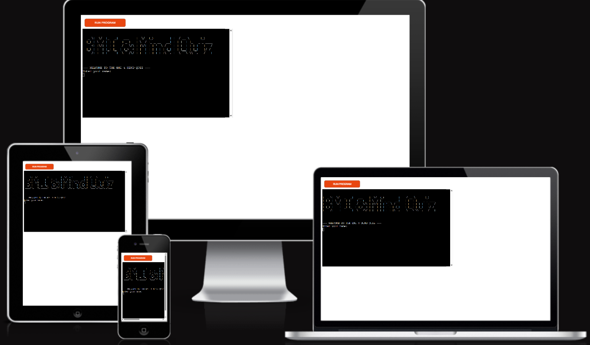
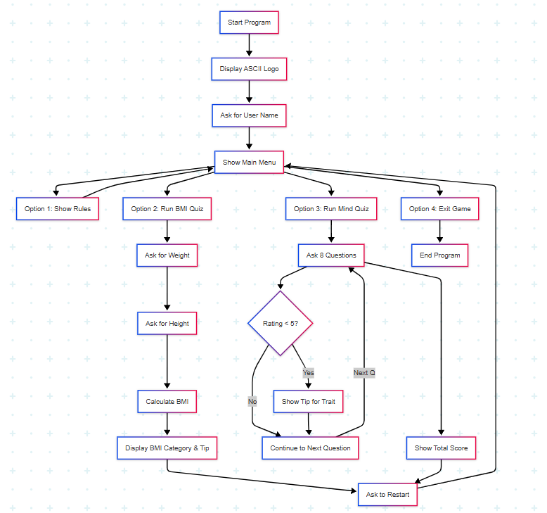
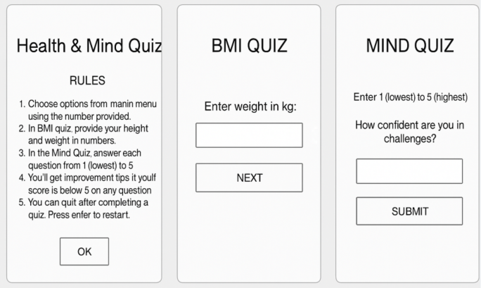
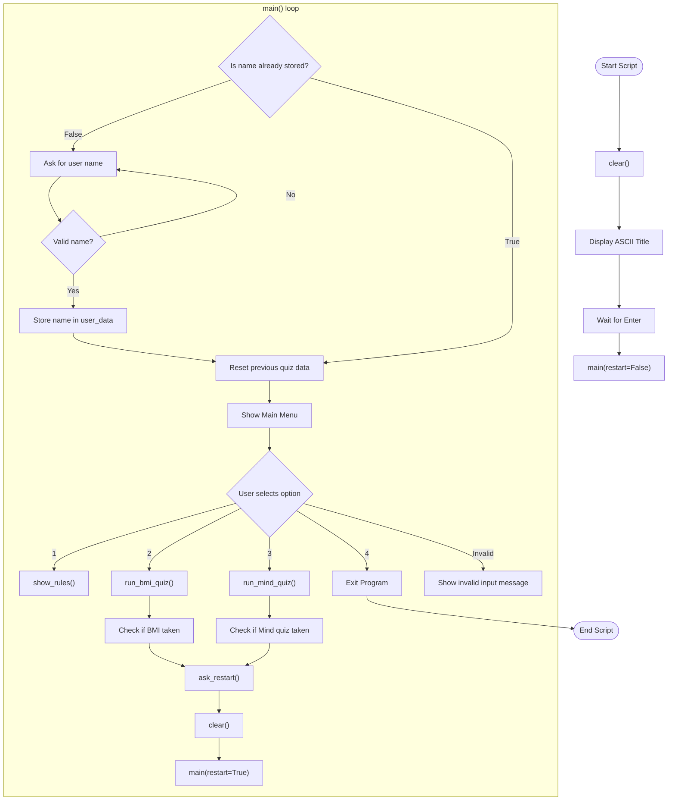
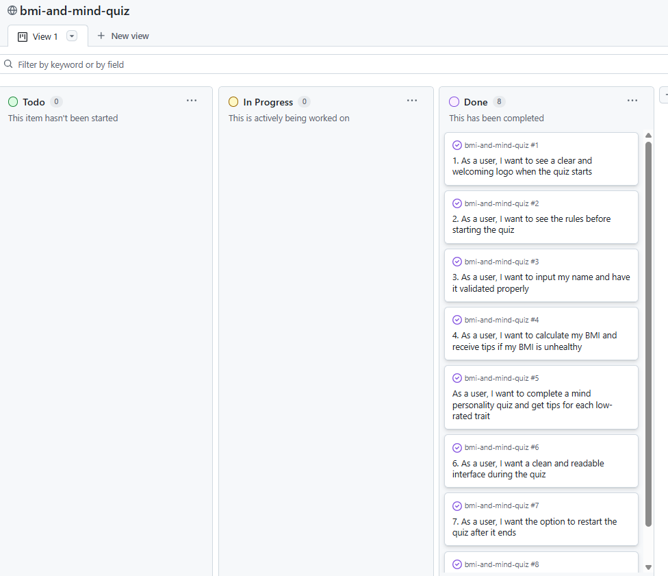

# [bmi-and-mind-quiz](https://bmi-and-mind-quiz-250e063864a5.herokuapp.com)
## 📚 Table of Contents

- [Project Title](#bmi-and-mind-quiz)
- [Project Description](#project-description)
- [Live Site](#live-website-on-heroku)
- [Site Mockups](#site-mockups)
- [UX](#ux)
  - [The 5 Planes of UX](#the-5-planes-of-ux)
    - [Strategy](#1-strategy)
    - [Scope](#2-scope)
    - [Structure](#3-structure)
    - [Skeleton](#4-skeleton)
    - [Surface](#5-surface)
- [Wireframes](#wireframes)
- [User Stories](#user-stories)
- [Features](#features)
  - [Existing Features](#existing-features)
  - [Future Features](#future-features)
- [Tools & Technologies](#tools--technologies)
- [Database Design](#database-design)
  - [Data Model](#data-model)
  - [Flowchart](#flowchart)
- [Agile Development Process](#agile-development-process)
  - [GitHub Projects](#github-projects)
  - [MoSCoW Prioritization](#moscow-prioritization)
- [Testing](#testing)
- [Deployment](#deployment)
  - [Heroku Deployment](#heroku-deployment)
  - [Local Development](#local-development)
    - [Cloning](#cloning)
    - [Forking](#forking)
- [Credits](#credits)
  - [Content](#content)
  - [Acknowledgements](#acknowledgements)

## Project Description
Developer: Mairi Aissatou ([mairima](https://www.github.com/mairima))

The BMI and Mind Quiz is a Python-based terminal application designed to promote self-awareness and healthy living. Users can calculate their Body Mass Index (BMI) and take an 8-question mental strength quiz that assesses traits like self-appreciation, confidence, time management, and emotional resilience. Personalized improvement tips are provided based on user responses. The tool is interactive, educational, and ideal for individuals looking to track both their physical and mental well-being.

Live website on Heroku: *([BMI & MIND QUiZ](https://bmi-and-mind-quiz-250e063864a5.herokuapp.com/))*

**Site Mockups**

Source:*([amiresponsive](https://ui.dev/amiresponsive?url=https://bmi-and-mind-quiz-250e063864a5.herokuapp.com))*

> [!IMPORTANT]
> The examples in these templates are strongly influenced by the Code Institute walkthrough project called "Love Sandwiches".

## UX

### The 5 Planes of UX
#### 1. Strategy

**Purpose**
- Help users reflect on their mental well-being and physical health by providing a quick and guided self-assessment.

**Primary User Needs**
-A simple, way to assess health and mindset.
-Personalized feedback and improvement tips.
-Option to track progress or retake the quiz.

**Business Goals**
-Encourage self-awareness.
-Provide value through insights and tips.
-Make the quiz lightweight and accessible to anyone with Python.

#### 2. Scope

**[Features](#features)** (see below)

**Content Requirements**
-Mindfulness-based quiz questions.
-BMI health categorization.
-Personalized feedback/tips per trait or BMI result.

#### 3. Structure

**Information Architecture**
**Interaction Design**:
- Menu-based navigation (View rules, Take BMI quiz, Take Mind quiz, Exit).
- Linear question flow for quizzes.
- Immediate feedback and summary scores.
**User Flow**
- Home → Menu → Selected Quiz → Tip Output → Restart
- Persistent user data (name, score, BMI) stored in memory or files.

#### 4. Skeleton

**Navigation Design**:

Simple numeric menu: 1 for rules, 2 for BMI, 3 for Mind Quiz, 4 for Exit.
Prompts are minimal and contextual.
Validation for name input, quiz answers, and restart flow.

**[Wireframes](#wireframes)** (see below)

#### 5. Surface

**Visual Design Elements**
- Visual Design:
- ASCII logo using pyfiglet adds a visual identity.
- Consistent section titles (e.g., === BMI QUIZ ===) improve readability.
- Emojis (✅❌💡) enhance user feedback.

**Tone and Experience**:

- Friendly, motivational tone.
- Immediate, actionable tips reinforce a growth mindset.

## Wireframes

To follow best practice, a flowchart was created to showcase the progression of the Python app.
I've used [mermaidchart](https://www.mermaidchart.com/raw/545df7e8-5185-41fd-b02c-77d6886f6edb?theme=light&version=v0.1&format=svg) to design my app flowchart with Chatgpt influence.

## User Stories

| Target | Expectation | Outcome |
| --- | --- | --- |
| As a user | I want to see the rules before starting the quiz | so that I can understand how the quiz works |
| As a user | I want to calculate my BMI  | so that I can receive or find tips if my BMI is unhealthy |
| As a user | I want to complete a mind personality quiz | so that I receive or find tips for each low-rated trait |
| As a user | I want to input my name and have it validated properly | To ensure that each user's quiz session is personalized |
| As a user | I want the option to restart the quiz after it ends
| so that I can immediately retake the quiz if needed |
| As a user | I want to exit the quiz from the main menu | so that I can  gracefully leave the application when needed |

## Features

### Existing Features
| Feature |
| --- |
-BMI Calculator with health category feedback.
-8-question mind personality quiz.
-Improvement tips for each response below optimal rating.
-Clear rules and menu navigation.
-Optional logo/title splash screen.

### Future Features
 - **Personality Progress Tracker**: Store and visualize mind quiz scores over time. Store quiz scores in a CSV or database, and show a graph using matplotlib.
 - **User Accounts Login System**: Let users sign in and view their history.
 - **Email Results to Users**: Send quiz summaries via email.
 - **Web Interface**: Build a web version.

## Tools & Technologies

| Tool / Tech | Use |
| --- | --- |
|  | Generate README and TESTING templates. |
|  | Version control. (`git add`, `git commit`, `git push`) |
|  | Secure online code storage. |
|  | Local IDE for development. |
|  | Back-end programming language. |
|  | Hosting the deployed back-end site. |

## Database Design

### Data Model

#### Flowchart

I used ChatGPT to help generate a Mermaid Flowchart with my Python functionalities.

Source: [Mermaid Flowchart for bmi-and-mind-quiz](https://mermaid.live/edit#pako:eNp9VW1v2jAQ_iuWP7USrQgFViJtUwddhVSqrXSbtlEhNzFgNbEz22lLgf--O-eFBErzITmfn3vu8dm-rGigQk59OovUc7Bg2pK7wUQSeMYWRkd_J9QZZBxokdgJvT_OpvsRZ9qD6QCNo2OYySa-aSHttZormBsIk0RsSS7G_eGQ3Akb8RL3iwl7KS3XgEObzJQmzlFCRkzIPosiQMRgHmluUMvHrywyPMtY0UpOTj7lspxZCnGjMp0bFcwFgUkf5polCzdxrVRSpDwmEYxKRfhccXvDYr6a0KEhEizCIs1ZuCTGKs3DzxO62aIvzCOigQ8st8bUgAiMq7H-ZJEImeU5tRs6VJ1ujClyQmdnCoR0tFNgYDXaW264HYAX8M4mieZPQqWG_EvFK9kLGC_U84jLFPnBdAUh6Kih0NFfKBGg1h-4IMMjHlhDVGKFkk7zXsmw9Gu3eeuiLm43qmt_uyIu8jc3620BXGS5vHfCblSZ7ZCmO52CpDfISpfLVtQmO0JlCaqsW68j9oA1jbg5CGityZfR8DtsxUHI2ZqMhAzfxbTX5PJF2KtaAXcwQ_mEpVmT3NgX76TCxhtY51TjoHKv8cmlAkSncvoQiykeoh1QITZHxTB8C1boBRiacF0VXMG4hqkpLU6kyJzwTVJLYm4Mm_NKM6gIzVrCggeP4BizJ76vcgtBT4bZoqqxkN8NiZghP7HskcNBv3cMcMBus-60E1ywVqPRl12_gxy1BpJ7gYKZx2neBV05tz2vVWvFxeVAIN7g3Q6KB367HVyGRcZiVxzBpQzxBwCfWvunDTrXIqS-BZYGjbkGbhjSFXJMqF1wbG4-mCGfsTSCuIncQFjC5B-l4iJSq3S-oP4MO0KDpgle24FgeAxKCGjjuq9SaanfcwzUX9EX6nvdzmmnBe_mebsJr267QZfUP2m3T3sfvGar2_U8r9dpep1Ng766rN6pd95rt71O1-v2znveWbdBeSigo4yyv6D7GTYoS60aL2WQidj8B95tPhU)

#### Classes & Functions

The program uses classes as a blueprint for the project's object-oriented programming (OOP). This allows for the object to be reusable and callable where necessary.

#### Imports

## Agile Development Process

### GitHub Projects
[GitHub Projects](https://www.github.com/mairima/bmi-and-mind-quiz/projects) served as an Agile tool for this project. Through it, EPICs, User Stories, issues, and Milestone tasks were planned, then subsequently tracked on a regular basis using the Kanban project board.

### MoSCoW Prioritization

I've decomposed my Epics into User Stories for prioritizing and implementing them. Using this approach, I was able to apply "MoSCoW" prioritization and labels to my User Stories within the Issues tab.

- **Must Have**: guaranteed to be delivered - required to Pass the project (*max ~60% of stories*)
- **Should Have**: adds significant value, but not vital (*~20% of stories*)
- **Could Have**: has small impact if left out (*the rest ~20% of stories*)

## Testing

> [!NOTE]
> For all testing, please refer to the [TESTING.md](TESTING.md) file.

## Deployment

Code Institute has provided a [template](https://github.com/Code-Institute-Org/python-essentials-template) to display the terminal view of this backend application in a modern web browser. This is to improve the accessibility of the project to others.

The live deployed application can be found deployed on [Heroku](https://bmi-and-mind-quiz-250e063864a5.herokuapp.com).

### Heroku Deployment

This project uses [Heroku](https://www.heroku.com), a platform as a service (PaaS) that enables developers to build, run, and operate applications entirely in the cloud.

Deployment steps are as follows, after account setup:

- Select **New** in the top-right corner of your Heroku Dashboard, and select **Create new app** from the dropdown menu.
- Your app name must be unique, and then choose a region closest to you (EU or USA), then finally, click **Create App**.
- From the new app **Settings**, click **Reveal Config Vars**, and set the value of **KEY** to `PORT`, and the **VALUE** to `8000` then select **ADD**.
- If using any confidential credentials, such as **CREDS.JSON**, then these should be pasted in the Config Variables as well.
- Further down, to support dependencies, select **Add Buildpack**.
- The order of the buildpacks is important; select `Python` first, then `Node.js` second. (if they are not in this order, you can drag them to rearrange them)

Heroku needs some additional files in order to deploy properly.

- [requirements.txt](requirements.txt)
- [Procfile](Procfile)

Install this project's **[requirements.txt](requirements.txt)** (*where applicable*) using:

- `pip3 install -r requirements.txt`

If ones own packages have been installed, then the requirements file needs update using:

- `pip3 freeze --local > requirements.txt`

The **[Procfile](Procfile)** can be created with the following command:

- `echo web: node index.js > Procfile`

For Heroku deployment, follow these steps to connect your own GitHub repository to the newly created app:

Either (*recommended*):

- Select **Automatic Deployment** from the Heroku app.

Or:

- In the Terminal/CLI, connect to Heroku using this command: `heroku login -i`
- Set the remote for Heroku: `heroku git:remote -a app_name` (*replace `app_name` with your app name*)
- After performing the standard Git `add`, `commit`, and `push` to GitHub, you can now type:
	- `git push heroku main`

The Python terminal window should now be connected and deployed to Heroku!

### Local Development

This project can be cloned or forked in order to make a local copy on your own system.

For either method, you will need to install any applicable packages found within the [requirements.txt](requirements.txt) file.

- `pip3 install -r requirements.txt`.

If using any confidential credentials, such as `CREDS.json` or `env.py` data, these will need to be manually added to your own newly created project as well.

#### Cloning

Clone the repository by following these steps:

1. Go to the [GitHub repository](https://www.github.com/mairima/bmi-and-mind-quiz).
2. Locate and click on the green "Code" button at the very top, above the commits and files.
3. Select whether you prefer to clone using "HTTPS", "SSH", or "GitHub CLI", and click the "copy" button to copy the URL to your clipboard.
4. Open "Git Bash" or "Terminal".
5. Change the current working directory to the location where you want the cloned directory.
6. In your IDE Terminal, type the following command to clone the repository:
	- `git clone https://www.github.com/mairima/bmi-and-mind-quiz.git`
7. Press "Enter" to create your local clone.

Alternatively, if using Gitpod, you can click below to create your own workspace using this repository.

**Please Note**: in order to directly open the project in Gitpod, you should have the browser extension installed. A tutorial on how to do that can be found [here](https://www.gitpod.io/docs/configure/user-settings/browser-extension).

#### Forking

By forking the GitHub Repository, you make a copy of the original repository on our GitHub account to view and/or make changes without affecting the original owner's repository. You can fork this repository by using the following steps:

1. Log in to GitHub and locate the [GitHub Repository](https://www.github.com/mairima/bmi-and-mind-quiz).
2. At the top of the Repository, just below the "Settings" button on the menu, locate and click the "Fork" Button.
3. Once clicked, you should now have a copy of the original repository in your own GitHub account!

There are no remaining major differences between the local version when compared to the deployed version online.

## Credits

### Content

| Source | Notes |
| --- | --- |
| [Markdown Builder](https://markdown.2bn.dev) | Help generating Markdown files |
| [Love Sandwiches](https://codeinstitute.net) | Code Institute walkthrough project inspiration |
| [Real Python](https://realpython.com/python-quiz-application) | Inspiration for a quiz app |
| [BroCode](https://www.youtube.com/watch?v=ag8NtD1e0Kc) | Inspiration from Python tutorials|
| [Python Tutor](https://pythontutor.com) | Additional Python help |
| [ChatGPT](https://chatgpt.com) | Help with code logic and explanations |
| [Stackoverflow](https://stackoverflow.com/questions/2084508/clear-the-terminal-in-python/50921841#50921841) | Help python code on clear function|

### Acknowledgements

- I would like to thank my Code Institute mentor, [Tim Nelson](https://www.github.com/TravelTimN) for the support throughout the development of this project.
- I would like to thank the [Code Institute](https://codeinstitute.net) Tutor Team and facilitator for their assistance with advice.
- I would like to thank the [Code Institute Slack community](https://code-institute-room.slack.com) for the contents; it inspires. 

