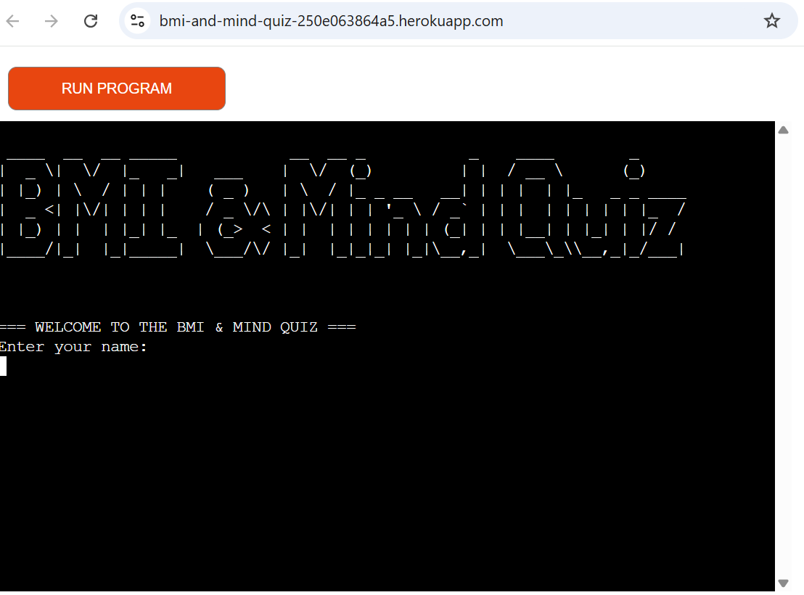

# Testing
> [!NOTE]
> Return back to the [README.md](README.md) file.

## Code Validation

### Python

I have used the recommended [PEP8 CI Python Linter](https://pep8ci.herokuapp.com) to validate all of my Python files.

| Directory | File | URL | Screenshot | Notes |
| --- | --- | --- | --- | --- |
|  | [run.py](https://github.com/mairima/bmi-and-mind-quiz/blob/main/run.py) | [PEP8 CI Link](https://pep8ci.herokuapp.com/https://raw.githubusercontent.com/mairima/bmi-and-mind-quiz/main/run.py) |  | Notes (if applicable) |

## Responsiveness
I've tested my deployed project to check for responsiveness issues.

| Mobile | Tablet | Desktop | Notes |
| --- | --- | --- | --- |
|  |  |  | Mobile issues: `overflow-x`, doesn't work on iPhones, but does work on Android with some limitations |

## Browser Compatibility
I've tested my deployed project on multiple browsers to check for compatibility issues.

| Chrome | Firefox | Safari | Notes |
| --- | --- | --- | --- |
|  |  |  | Chrome: work as expected. Firefox: emojis get cut-off. Safari: some limitations. |

## Lighthouse Audit
I've tested my deployed project using the Lighthouse Audit tool to check for any major issues. Some warnings are outside of my control, and mobile results tend to be lower than desktop.

| Mobile | Desktop |
| --- | --- |
|  |  |

## Defensive Programming
Defensive programming was manually tested with the below user acceptance testing:

| Feature | Expectation | Test | Result | Screenshot |
| --- | --- | --- | --- | --- |

## User Story Testing
| Target | Expectation | Outcome | Screenshot |
| --- | --- | --- | --- |

