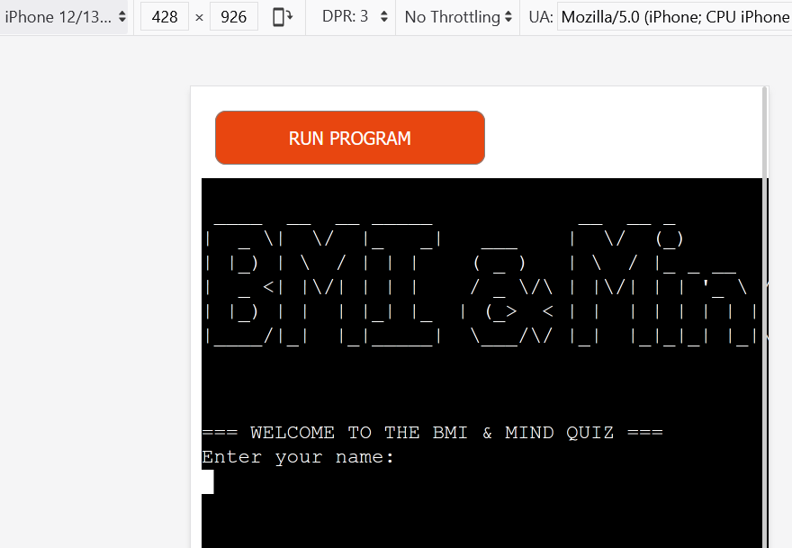
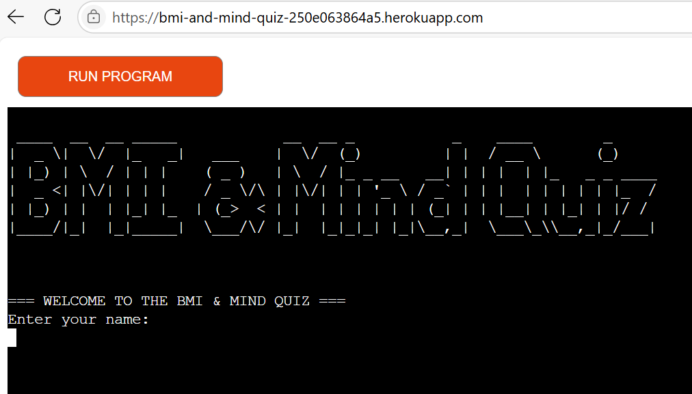
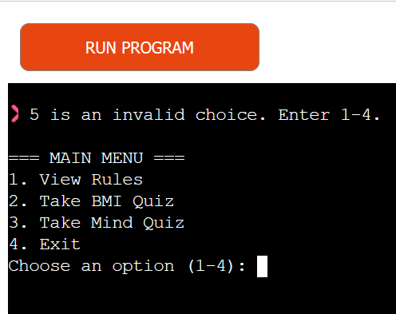

# Testing

## Code Validation

### Python

I have used the recommended [PEP8 CI Python Linter](https://pep8ci.herokuapp.com) to validate all of my Python files.

| Directory | File | URL | Screenshot | Notes |
| --- | --- | --- | --- | --- |
|  | [run.py](https://github.com/mairima/bmi-and-mind-quiz/blob/main/run.py) | [PEP8 CI Link](https://pep8ci.herokuapp.com/https://raw.githubusercontent.com/mairima/bmi-and-mind-quiz/main/run.py) |  | pass|

## Responsiveness
This is a python template provided by Code institute. Interactions works on Desktop. For mobiles, it shows on apple without interaction, it shows on Android devices and interacts on Android only.
| Mobile | Desktop |
| --- | --- |
|  | |

## Browser Compatibility
I've tested my deployed project on multiple browsers to check for compatibility issues.

| Chrome | Firefox| Edge | Notes|
| --- | --- |--- |---|
|  |  | |Chrome: work as expected.  Firefox: emojis get cut-off.  Edge: work as expected.|

## Lighthouse Audit
I've tested my deployed project using the Lighthouse Audit tool bellow is the score.

| Desktop |
| --- | 
|  |

## Defensive Programming
Defensive programming was manually tested with the below user acceptance testing:

| Feature | Expectation | Test | Result | Screenshot |
| --- | --- | --- | --- | --- |
|BMI Calculator with feedback | -Accepts valid height and weight calculates BMI, classifies category;  -Handles zero or negative values gracefully; -Handles non-numeric input; -Provides correct tip if BMI not in "Normal"  |-Input: weight=70, height=1.75; -Input: weight=0, height=1.75 or -70; Input: weight="abc";  -Input: weight=100, height=1.70| (Pass)- BMI: 22.9 → Output: “Normal” + no tip;-Show error: “❌ Enter a valid number.”; -Show error: “❌ Enter a valid number.”; -BMI: 34.6 → Output: "Obese" + Tip: Seek structured plan with help	|  |
|8-question mind personality quiz | =Accepts numeric input from 1–5 only;  -Rejects input outside 1–5;  -Handles string or empty input| -Input: 4 → continue, Input: 8;  -Input: "text", "";  -Input: 2 for "Confidence"  | (Pass)-Accept input, no error;  -Show error: “❌ 8 is invalid. Enter a number between 1 and 5.”; -Show error message and re-prompt |  |
| Improvement tips for low scores| Displays tip immediately after score < 5| Input: 2 for "Confidence" | Output: Tip: “Set small goals and celebrate wins.”|  |
| Clear rules & menu navigation |Rules explain options and expectations clearly;  Menu handles wrong inputs and redirects;  Restart option shows up after quiz| Select "1. View Rules";  Input: "9", "abc";  Finish quiz, press Enter | Displays quiz types;  input format, how to restart, etc.;  Error message: “Invalid choice. Enter 1-4.”;  Returns to menu or re-runs main() |  |
|logo splash screen | Shows logo at the start using pyfiglet | Start script | “BMI & Mind Quiz” is rendered as ASCII art |  |

## User Story Testing
| Target | Expectation |Test Scenario | Outcome | Status |
| --- | --- | --- | --- | --- |
|1. As a user, I want to see the rules before starting the quiz | Clear instructions before using the quiz| Select option 1 from main menu|Rules explain quiz types, inputs, tips, restart options | Pass |
|2. As a user, I want to input my name and have it validated properly | User name must be non-empty and letters only | Input: "", then "123", then "Alice" | Shows error on invalid names, accepts "Alice"| Pass |
| 3.As a user, I want to calculate my BMI and get category-specific tips | Accurate BMI formula, health category output, and tips if needed| Input: weight=70kg, height=1.75m | Output: BMI=22.9, category="Normal", no tip | Pass |
| 4. As a user, I want to take a personality quiz about mental habits |Users answer 8 traits (1–5), receive real-time tips for answers < 5| Input: 1 for "Confidence" | Tip shown for “Confidence”| Pass |
| 5. As a user, I want to exit the quiz from the main menu| Option to quit cleanly | Select option 4 from main menu |Message: “Thank you for using BMI & Mind Quiz” → program exits| Pass |
| 6.As a user, I want to restart after completing a quiz| Prompt to restart or return to menu | Finish a quiz, press Enter | Returns to main menu and restarts flow | Pass |
| 7.As a user, I want a welcome screen with a splash logo |Terminal prints app name in ASCII art | Start app with pyfiglet installed| "BMI & Mind Quiz" banner shown | Pass |
| 8.As a user, I want to see my total score after mind quiz | Total score (/40) or (/45) shown after final question | Input valid answers to all questions | Prints: “Your total mind score is yy/40”|  Pass|

## Known Issues

- Emojis are cut-off when viewing the application from Firefox.
- The Python terminal doesn't work well with Safari, and sometimes uses cannot type in the application.
- If a user types `CTRL`+`C` in the terminal on the live site, they can manually stop the application and receive and error.

